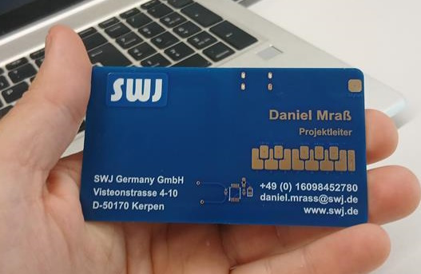
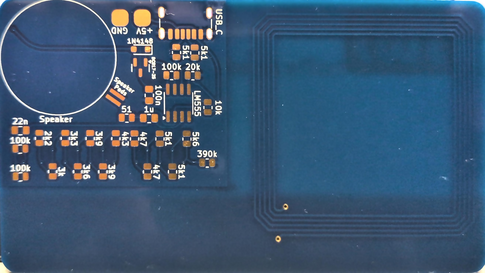
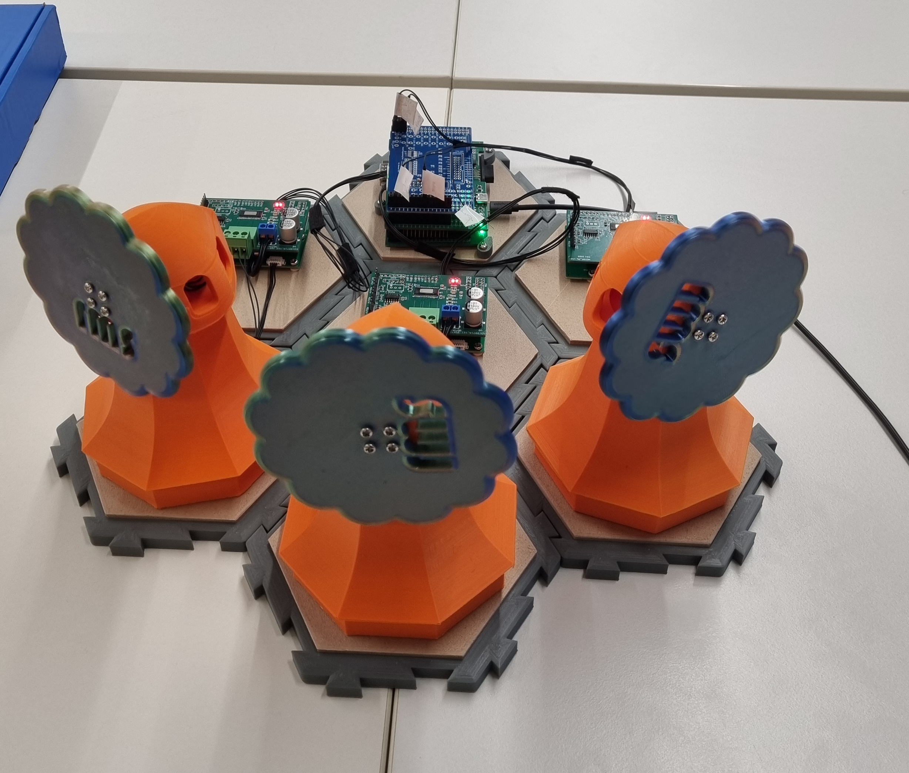
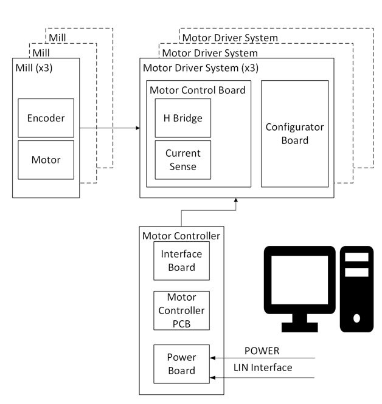
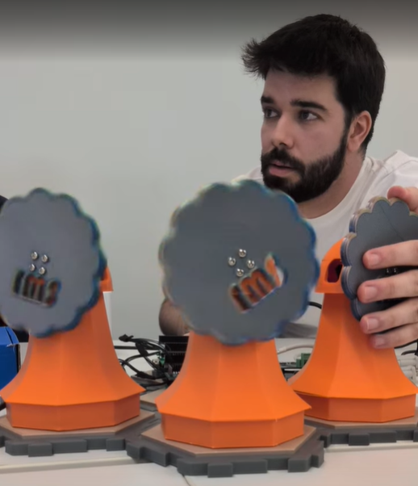

# SPS 2025 Nuremberg

SWJ will be showcasing its development capabilities in embedded Software and Hardware development, Validation & Testing and PMTs. Visit us in Hall 6, Stand 430.

This repository contains contact information and technical information for all demos showcased at SPS.

# SWJ at SPS: Daniel Mraß

<table border=0 >
<tr><td></td>
<td>Angestellt, Projektingenieur 
&nbsp;  
SWJ Germany GmbH 
Email: <a href="mailto:Daniel.Mrass@swj.de">Daniel.Mrass@swj.de</a> 
Web: <a href="www.swj.de">https://www.swj.de</a>
 </td></tr></table>

## NFC Business card

The business card showcases an 0.8mm PCB in the traditional 85x55mm format.

We designed the PCB tracks in a **shape that creates an NFC antenna** and added an IC from NXP to provide quick transfer of contact information. A LED was also added,  so the user would get the unusual feedback of failed and successful attempts at NFC communication (short led pulse = failed; long led = succeeded)

Further, the team decided to add a "cool" factor to the business card by creating a **sound synthesizer** from the classic **555 timer**. What better way to flex your E/E knowledge? 

You can find the [BOM and schematics to populate this circuit and build your own synthesizer here](nfc_businesscard/ee_schematic/SWJ_NFC_BusinessCard.pdf).

## Smart controlled Windmills

The windmill demo showcases a distributed control system with a cascaded closed loop approach.

The solution is entirely designed by SWJ: mechanics, electronics and software.

A [detailed presentation can be found here](windmills/251110_WindmillDemo_Overview(Coisa).pdf) (incl. system diagrams and component identifications)

### System Architecture

   
At the **lower** level the windmills have a motor with an encoder on the output shaft (before the reduction box) to allow precise control of speed and continuously sense the real rotation and stall and error conditions.

At the **high level**, a control loop was created in Vector CANoe that continuously queries the motors status (current, speed, errors) and updates the target speed.
This creates dynamic behaviours that produce different, selectable, modes:

* Constant sum of speed: if any windmill is blocked or has its speed reduced, the other windmills spun up so that the sum of all speeds remains constant within the system
* Follow the leader: by manipulating one windmill, the others will follow (i.e. if you slow it down, the others slow down; if you block it, the others block too)
* Winding clock: if you spin up the windmill manually, the others spin up as well, and their speed slowly decays as if winding down a spring

#### This project is a combination of multiple disciplines:
* Electronics design: for the Windmill motor drivers and the master STM low level controller (speed)

Check the Schematics here: [ee_schematics](windmills/ee_schematics)

* Software (Embedded and Control): embedded software for the STM low level controller (speed), and CANoe high level control

Check the Software here: [sw_canoe_simulation](windmills/sw_canoe_simulation)

* Mechanical design: 3D models for the windmills, base and overall mounting points  

Find 3D models here: [3dmodels_mechanical](windmills/3dmodels_mechanical)

